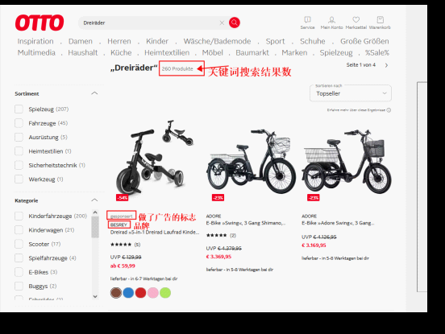
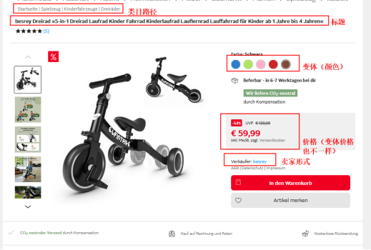
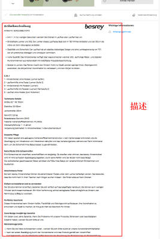
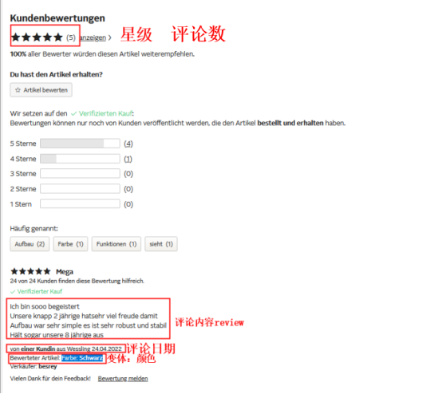
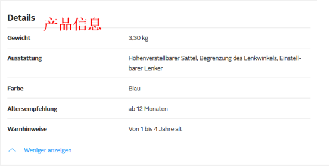

# 需求背景
根据关键词搜索，在otto平台爬取所有查询结果的产品链接信息
# 爬取信息
1.搜索结果数：获取方式见图1.6 

2.是否做广告：获取方式见图1.6

3.品牌：获取方式见图1.6

4.类目路径：获取方式见图1.7

5.标题：获取方式见图1.7

6.变体：（颜色/尺寸变体都抓下来）获取方式见图1.7

7.价格：（如果是变体，价格都抓下来）获取方式见图1.7

8.卖家形式：（分为Otto和第三方卖家）获取方式见图1.7

9.发货方式：卖家形式为Otto填Otto；卖家形式为第三方卖家填FBM即可

10.描述：获取方式见图1.8

11.评论数：获取方式见图1.9

12.星级：获取方式见图1.9

13.一星/二星/三星review（内容抓下来，如果有变体，变体也要抓下来）获取方式见图1.9

14.上架时间（就是抓取评论最早的日期）获取方式见图1.9

15.产品信息都抓下来：获取方式见图2.0

16.排名：排名就是在三级类目页，例如,排名P1 3 第一页第三个位置

 图1.6
 图1.7
 图1.8
 图1.9
 图2.0

# 技术点
IP代理池

requests,lxml

pandas,dataframe

# 安装及运行
修改```otto_keyword_crawl.py```中的`url_front`和`ky`值，直接运行即可